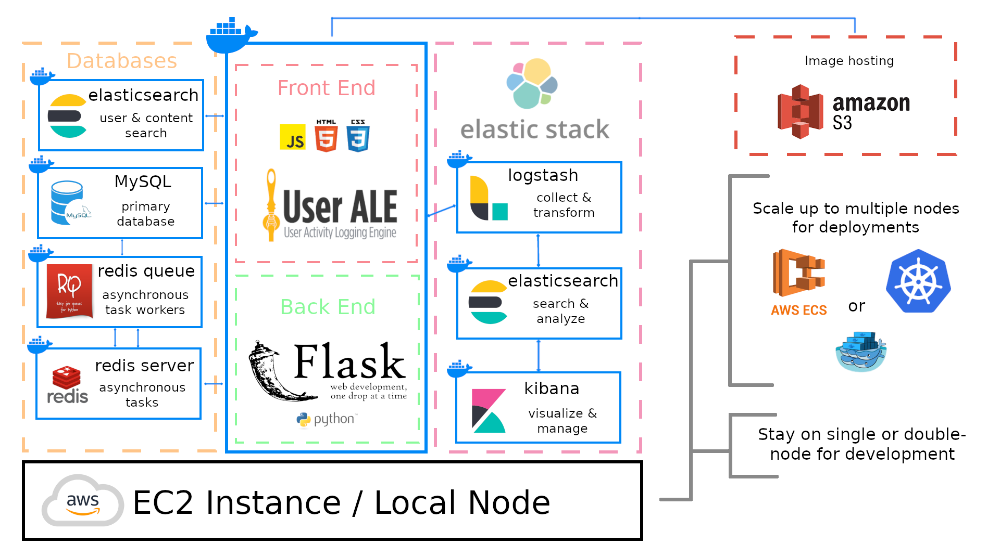
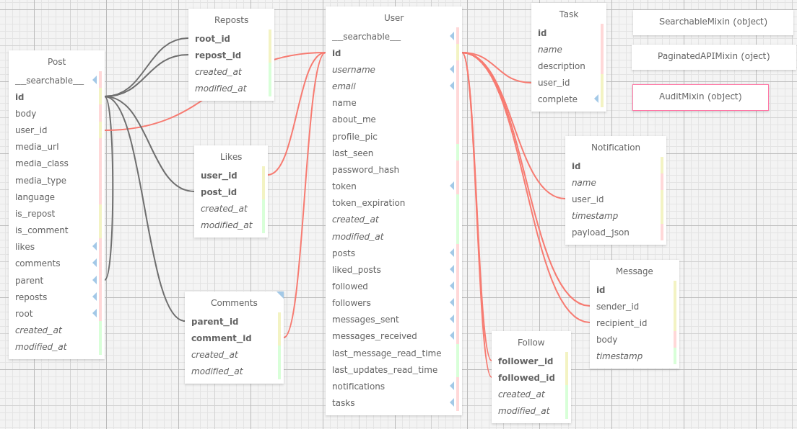

# Welcome to the Cognitive Security Social Media Simulator!

Developers: 
- Evan Jones, University of Maryland
- Mary Nwosu, Howard University

## About

The Cognitive Security Social Media Simulator (CSSMS) is an experimental social media simulation lab capable of testing and evaluating multi-participant interaction in a high-fidelity environment as part of ARLIS’s Cognitive Security Proving Ground (CSPG).

The application is written primarily in Python Flask and is built on top of Miguel Grinberg's [Microblog](https://github.com/miguelgrinberg/microblog), a Flask app created by Miguel as part of his [Flask Megatutorial](https://blog.miguelgrinberg.com/post/the-flask-mega-tutorial-part-i-hello-world). For those interested in getting a high-level understanding of the Flask App architecture, please refer to the tutorial.

### Core functionalities of the simulator: 
- Ability to arbitrarily ingest real-world data sets via a REST API
- Ability to instrument and track user behavior in real time via [Apache Flagon's UserALE](https://flagon.incubator.apache.org/)
- Ability for users to message each other; post, comment, share & like content (MySQL)
- Admin ability to monitor, delete, and block content as necessary
- Extensible (the application relies on docker and docker-compose for deployment)
- High fidelity front-end user interface (Material Bootstrap for templating)

### Design Principles
- _extensibility_ -- how easily can we add, subtract, modify, and swap components of the app?
- _scalability_ -- it works well with a few users, but can it run with 50, 100, 1000, or tens of thousands of users?
- _reliability/reproducibility_ -- it works on developer A and B’s local environments, but will it work in production? If we decide to deploy it on bare-metal servers, can we? Can we deploy it easily on different cloud platforms (Azure, AWS, GCP)? Can we mix-and-match cloud resources if necessary?

These principles are closely related; part and parcel of a DevOps approach. With that in-mind, we followed an Infrastructure as Code (IaC) approach, utilizing Docker and containerizing as much of the app’s components as possible. The idea is that this automatically enables extensibility, gets us 95% of the way towards guaranteeing reliability/reproducibility, and puts whomever is in charge of deployment on solid ground for easy scalability. With the help of docker-swarm, Amazon ECS or kubernetes, the app should easily be able to scale up to the requisite number of nodes for smooth functioning with varying user loads.

### App Architecture

In production, the app itself consists of 9 different microservices running in unison. The web app itself can be run locally, outside of a docker container for testing & development. However, its functionalities are limited in that case. Each of the containers are defined in [`docker-compose.yml`](docker-compose.yml) which also reads in hyperparameters such as access tokens, connection URIs, etc. from a local `.env` file (see [Configuring the .env fFile](###Configuring-the-.env-File)).

We use Python Flask as the web app back-end and the front-end consists of standard javascript and html. We use Material Design Bootstrap's css templates. The front-end is instrumented with Apache Flagon's UserALE which tracks and logs all user behavior in the browser. UserALE can utilize any back-end to store the logs, however we opted to use the standard Elasticsearch, logstash, and Kibana (ELK) stack for which the Flagon team provides a docker-compose file. More information on configuring UserALE and the ELK stack can be found in the [Configuring UserALE](###Configuring-UserALE) section.

Images are hosted on a remote Amazon S3 server and stored as URLs in the MySQL database. The connection to the S3 server is specified in the `.env` file and instantiated in [`__init__.py`](__init__.py) using the `boto3` SDK. However, in theory, any S3 server can work so long as the S3 credentials are changed in `.env` and an appropriate Python SDK is swapped out for boto3.

User information and posts are stored in a separate elastisearch server. The search bar is connected to this server so that users can search for content and other users. We use Redis and Redis Queue for background tasks. Finally, we use MySQL for the relational database to store all the models. The models are created with the use of Flask-SQLAlchemy and so are completely independent from the SQL flavor chosen. Although we chose MySQL, this container can be swapped out for any flavor of SQL that is [compatible with SQLAlchemy](https://docs.sqlalchemy.org/en/14/dialects/).

Below is an app architecture diagram:



Currently, we are running the app on a single node. In production, however, the UserALE elastic stack should be on it's own node, at minimum (better spread across 3 or more nodes). Because the app is completely containerized it can be scaled up to any number of nodes necessary to handle traffic of any volume. We have left the choice up to users as to how they want to scale up and deploy the application (AWS ECS, docker-swarm, Kubernetes, etc.). In the future, we plan to include example scripts for how to deploy with these services.

### Database Schema

Below is a diagram of the MySQL relational database:



## Setup

### Dependencies
- [Python >= 3.8.5](https://www.python.org/downloads/release/python-385/)
- [Docker version >= 20.10.7](https://docs.docker.com/engine/release-notes/#20107)
- [Docker-Compose](https://docs.docker.com/compose/install/)
- [SQLite3](https://www.sqlite.org/index.html) (Testing & Development)

### Configuring the .env File

_Forthcoming_

### Local Installation & Launch

Setting up a virtual environment:
```sh
$ python3 -m venv venv
$ source venv/bin/activate
```
If you are using a Microsoft Windows command prompt window, the activation command is slightly different:
```sh
$ venv\Scripts\activate
```
Now install the python dependencies from `requirements.txt`:
```sh
(venv) $ pip install -r requirements.txt
```
To run the Flask app locally, you must define a few environment variables and run the database migrations:
```sh
# point flask to app
(venv) $ export FLASK_APP=cssms.py
# specify the deployment type (development is good for debugging)
(venv) $ export FLASK_ENV=development 
# instantiate sqlite db and update tables
(venv) $ flask db upgrade
# Run
(venv) $ flask run
```
### Docker Install / Launch

As long as you have the correct Docker and Docker-compose dependencies installed, launching the app via Docker is as simple as three commands:
```sh
# Create the private networks for the UserALE containers and Database containers, respectively (see app architecture diagram)
$ docker network create esnet
$ docker network create dbnet

# Build and launch containers
$ docker-compose up --build
```
After the containers have been built once using the `--build` flag, they need not be built again unless changes have been made to the source code. A simple `docker-compose up` command will quickly deploy the app.

To tear down the app, run `docker-compose down` in any terminal.

### Configuring UserALE

_Forthcoming_

## Data Ingestion API

The full Swagger API documentation can be found at the `http://<hostname>/api/docs` route once the website has been launched.

For an example of how to send social media data to the database, see  the `ingest_tweets.ipynb` jupyer notebook in the `examples/api/`. This notebook wrangles the `tweets.csv`---the ['How ISIS Uses Twitter'](https://www.kaggle.com/fifthtribe/how-isis-uses-twitter) dataset publicly available from kaggle---and creates users and their posts via the relevant API routes.
